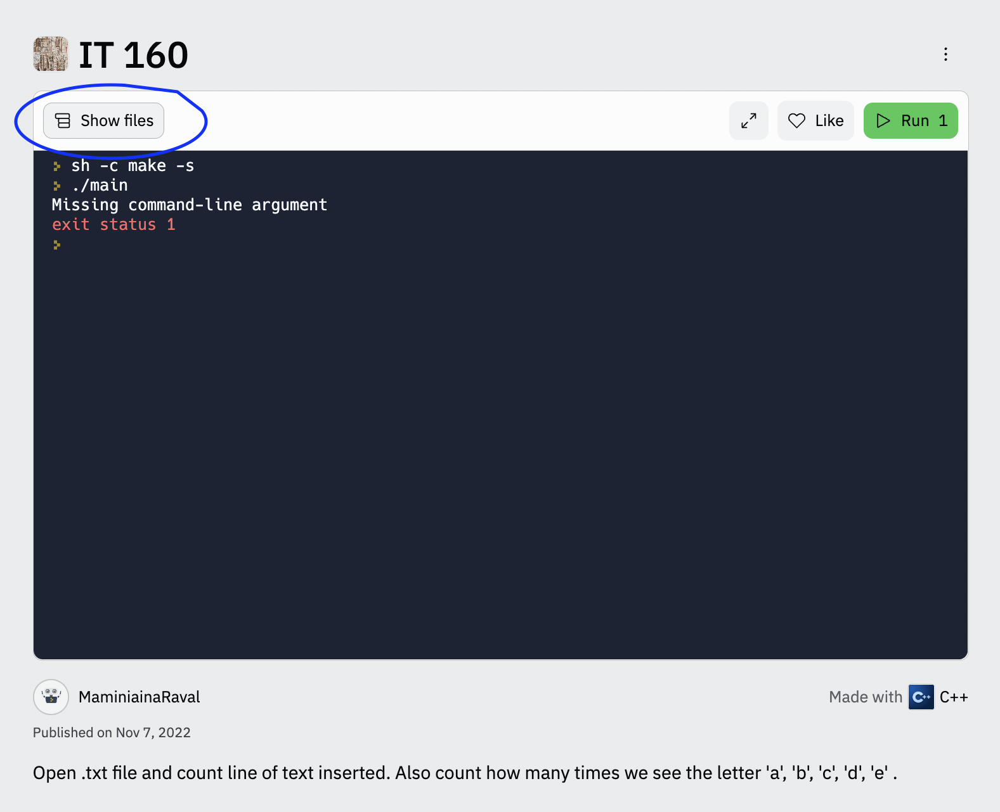
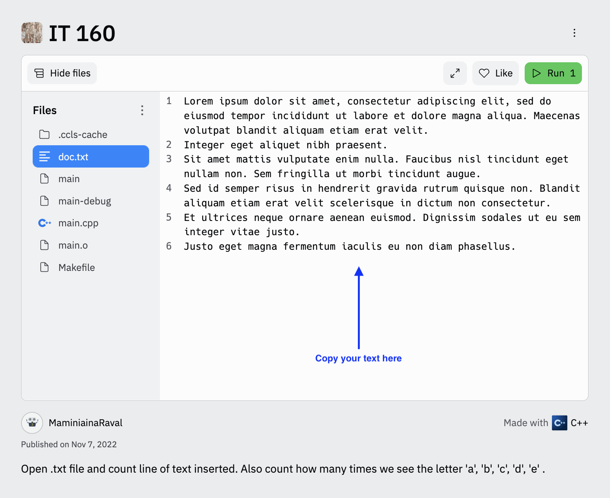
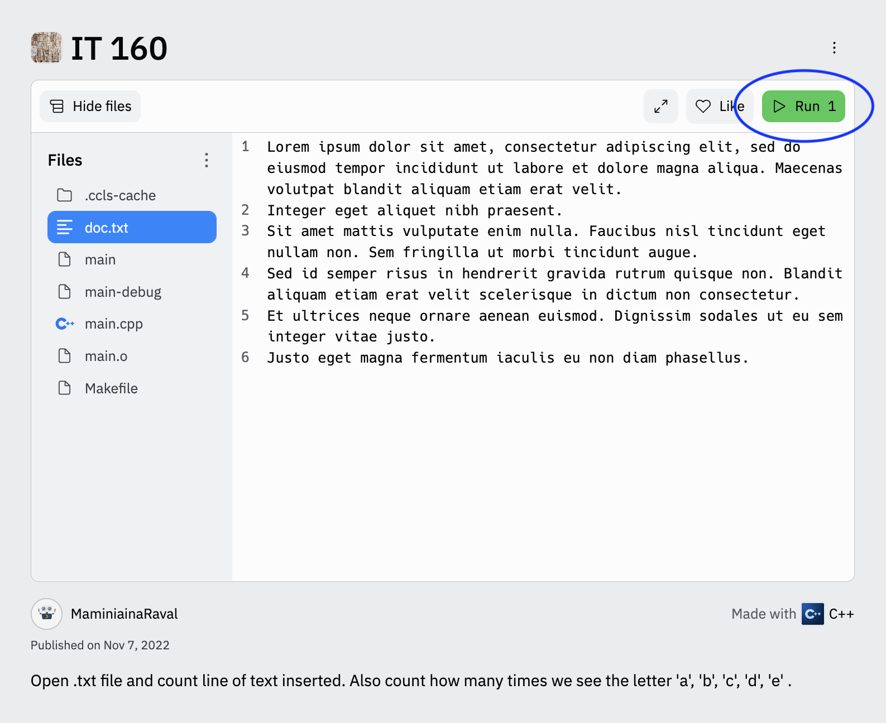
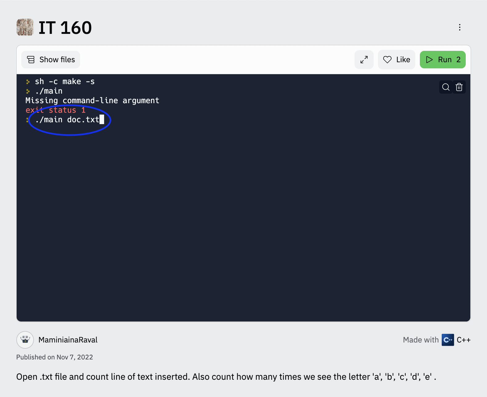
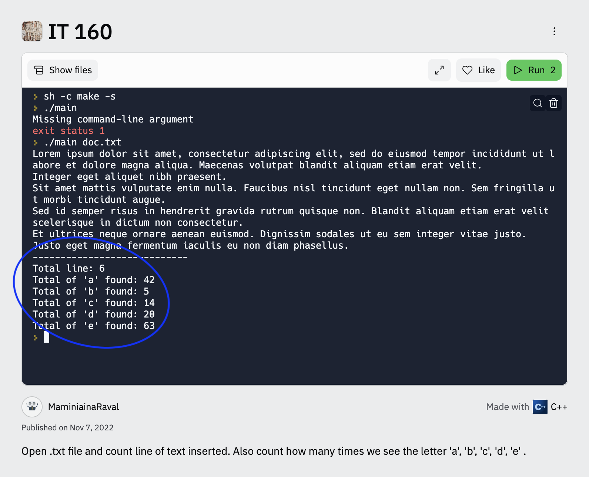

# IT 160 FP
## Link for a Demo

[https://replit.com/@MaminiainaRaval/IT-160?v=1](Live Demo)

## Description:
This program counts how many lines there are in a text inside of a `.txt` file. Features like counting how many times character like `'a', 'b', 'c' ...` have been found in the text has been implemented as well.

## How to run it:
```
If You are not able to edit the files, I would recommend skipping step 2, 3 and 4.
```
1. Follow the Demo link and `run` the program


2. Go to `files`



3. Copy and paste the text to read inside `doc.txt`



4. Click `run` again



5. Run the command `./main doc.txt`



6. The results will be printed right after the program re-print the text you entered.


