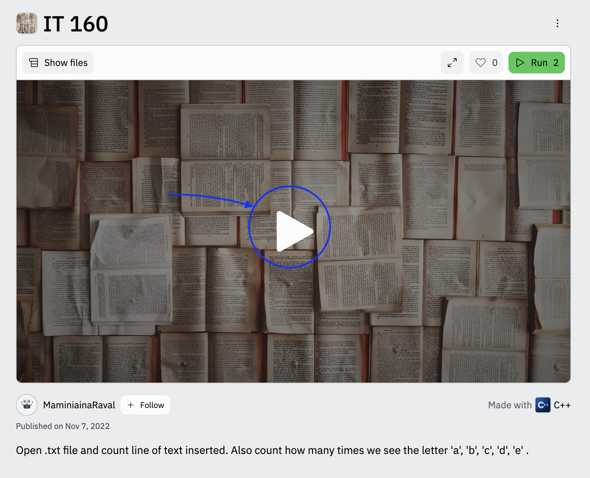

# IT 160 FP
## Link for a Demo

[Live Demo](https://replit.com/@MaminiainaRaval/IT-160?v=1)

## Description:
This program counts how many lines there are in a text inside of a `.txt` file. Features like counting how many times character like `'a', 'b', 'c' ...` have been found in the text has been implemented as well.

## How to run it:

1. Follow the link `Live Demo` and `run` the program

2. Run the command `./main doc.txt`

3. The results will be printed right after the program re-print the text you entered.

